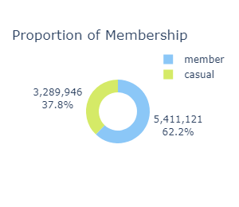

# Bike Share User Analysis


This project is the analysis of the **Google Data Analytics Professional Certicate** capstone task. I analyzed the user pattern of the membership types of Lyft Bikes and Scooters, a bike share company in Chicago. Lyft's bike-share program features more than 5,800 bicycles and 600 docking stations. Lyft sets itself apart by also offering reclining bikes, hand tricycles, and cargo bikes, making bike-share more inclusive to people with disabilities and riders who can’t use a standard two-wheeled bike. The majority of riders opt for traditional bikes; about 8% of riders use the assistive options. Lyft users are more likely to ride for leisure, but about 30% use them to commute to work each day.

## Senario

> The director of marketing believes the company’s future success depends on maximizing the number of annual memberships. Therefore, I have assigned to help the stakeholders to understand how casual riders and annual members use Lyft bikes differently. From these insights, we will design a new marketing strategy to convert casual riders into annual members. But first, Lyft executives must approve my recommendations, so they must be backed up with compelling data insights and professional data visualizations.

**Business Task:** To identify how annual members and casual riders use Lyft bikes share differently.

**Goal:** Design marketing strategies aimed at converting casual riders into annual members.

## Steps of Analysis

In this project, I intend to demonstrate the step by step process of data analytics problems. Therefore, I will be going through the various stages of data analysis. The following tools and libraries were used to complete the analysis and visualization - `Python Programming language`, `Pandas`, `Plotly`, `Jupyter Notebook`, and `Steamlit` for the dashboard visualization.

### _Methodology_

The steps of analysis includes

-  [Data Collection](#data-collection)
-  [Data Preprocessing](#data-preprocessing)

   -  [Data validation and preparation](#data-validation-and-preparation)
   -  [Data Cleaning](#data-cleaning)

-  [Exploratory Data Analysis](#exploratory-data-analysis)
-  [Dashboard Visualization (with Streamlit dashboard)](#dashboard-visualization)
-  [Recommendations](#recommendations)

### Data Collection

The dataset used for this project was made available by Motivate International Inc. under this [license](https://www.divvybikes.com/data-license-agreement). This data was collected for the years 2022 and 2023 of the bike share trips records. The data were downloaded from [here](https://divvy-tripdata.s3.amazonaws.com/index.html), which came in 24 different csv files formats, each for one months trip records. I downloaded and saved to a convenient directory in readiness for analysis.

### Data Preprocessing

The data set will be loaded into the R environment, inspected for consistency of datatypes and column names, and finally merged into one big dataframe.

#### _Data preparation and validation_

First, let's load the `Pandas` library, and other libraries that will be used in the analysis.

```python
import pandas as pd
import os
import glob
```

Next, I loaded the csv files into a `Pandas` dataframe and save them in a variable  using the following codes.

```python
# Get files from working directory
path = os.getcwd()
csv_files22 = glob.glob(os.path.join(path, "data22", "*.csv"))

csv_files = glob.glob(os.path.join(path, "data", "*.csv"))

dfs = []

for file in csv_files22:
    
    dfs.append(pd.read_csv(file))

for file in csv_files:
    
    dfs.append(pd.read_csv(file))
```

Next, Inspect all dataframes for consistency of datatypes and column names, and finally merged into one big dataframe.

```python
for df in dfs:
    df.info()
```

The results revealed that the column names and data types of the 24 data files were consistent.

To further investigate and clean the data, lets merge the data files into one dataframe.

```python
trip_data = pd.concat(dfs)
```

#### _Data Cleaning_

Here, I will check and remove duplicate values if any, handle missing values, and rename some columns with more descriptive names.

#### _Check for duplicate records_

Next we will check to verify that there are no duplicate records

```python
trip_data.duplicated().sum()
```

The output shows that there are no duplicate values, each row of the trip record represent a unique trip.

Next we will check shape of data to understand the total number of trip records collected over the period of interest.

```python
print(trip_data.shape)

total_trips, _ = trip_data.shape
```

The result shows that in the years 2022 and 2023, a total 11.3 million trips were recorded by Lyft bikes.

Next, I will rename the columns ride_id and rideable_type with a more descriptive names - trip_id and bike_id respectively.

```python
trip_data.rename(columns={"ride_id": "trip_id", "rideable_type": "bike_type"}, inplace=True)
```
### _Check for missing values_

```python
print(trip_data.isnull().sum())
```

The columns with missing values reveals that there are 1.8 million records with no start station or end station name and id. 

Hence, it will be difficult to track the routes of these trips. These records will be removed as their route information are inconclusive. 

However, this observation will be communicated to the team lead for further investigation.

```python
trip_data = trip_data.dropna(subset=["start_station_id", "end_station_id", "end_lat", "end_lng"])

print(trip_data.isnull().sum())
```

After cleaning the missing and empty values, it time to perform EDA to answer questions for further investigation.

### _Overview of the data_

```python
trip_data.describe(include='all')
```

### Exploratory Data Analysis

At this stage, I will be using specific questions to guide the process, and analyse the data to provide answers.

#### What is the total number of valid trips?

```python
num_of_valid_trips = (trip_data.shape)[0]

num_of_valid_trips
```


There are a total of 8.7 million valid trips record by Lyft bikes between 2022 and 2023.

#### What is the number of trips with missing details?

```python
num_of_invalid_trips = total_trips - num_of_valid_trips

print(num_of_invalid_trips)
```

#### What percentage of the trip records were invalid?

```python
percent_of_invalid_trips = (num_of_invalid_trips/total_trips)*100

print(round(percent_of_invalid_trips,1))
```

The results indicates that a total of 2.7 million records, which form 23.6% of the overrall trip records for the period were incorrectly captured.

The ideal next thing to do will be to report this discovery to the management throught the team lead for further investigation on what went wrong with the incorrectly captured data, before continuing with the analysis.

### Create new columns

In order to better understand and make sense the trip data, two new columns (`trip_duration` and `week_day`) will be created.

Convert date related columns to datetime objects, and create a `week_day` column

```python
trip_data["started_at"] = pd.to_datetime(trip_data["started_at"])

trip_data["ended_at"] = pd.to_datetime(trip_data["ended_at"])

trip_data['week_day'] = trip_data["started_at"].dt.day_name() # .strftime('%a') .strftime('%A')
```

#### What is the average trip duration?

```python
trip_data['trip_duration'] = round((trip_data["ended_at"] - trip_data["started_at"]).dt.total_seconds()/60,1)

print(round(trip_data['trip_duration'].mean(),2))
```

Here, we can see that the average trip duration is 16.5 minutes per trip.

Notice that the above calculation is in minutes, hence, we need to convert it to a proper time format i.e  `minute:seconds` format.

```python
trip_duration = str(int(round(trip_data['trip_duration'].mean(),2)//1))+':'+ str(int(round((round(trip_data['trip_duration'].mean(),2)%1)*60,1)))

print(trip_duration)
```
Now, it is obvious that the average trip duration is 16:31 per trip.

Add a new column to the dataframe to store the trip duration in the format of `minute:seconds`.


```python
trip_data['trip_dur'] = (trip_data['trip_duration']//1).astype(int).astype(str)+':'+(((trip_data['trip_duration']%1)*60)//1).astype(int).astype(str)
```

Having completed the preparatory stages, it is time to explore the data. At this stage of the analysis, Plotly charts will be used to visualize the data.

#### What is the proportion of user types?

Let's determine the proportion of the membership types on the trips records for the period of interest.



> -  Casual riders made 37.8% of the total trips recorded.
> -  Annual members made 62.2% of the recorded trips

#### What is the most used bike types by membership types?


> -  Most used Bike by both user groups is Classic bikes
> -  Docked bikes are only used by casual riders, and covered 7.6% of their total trips.

#### What is the average trip duration by membership type?


> -  Casual riders travel longer time per trip on average when compared with annual members
> -  Docked bike users traveled the longest trip duration on average.

#### Which week days do each membership type record highest number of trips?


> -  Casual riders record highest number of trips on weekends, with a peak on Saturdays
> -  Annual members record higher number of trips between Tuesdays and Thursdays, with a peak on Tuesdays.

#### Which week days do the membership types record highest average trip duration?


> -  Casual riders travel twice as long as annual members in trip duration per day on average
> -  Longer trip durations are recorded during weekends (Saturday & Sunday)

#### What are the most used routes by casual riders?


> -  Most used route by Casual riders is a round trip - from and to Streeter Dr & Ave.
> -  Majority of trips by Casual riders are round trips.

#### What are the most used routes by annual members


> -  Most used route by annual members is Ellis Ave & 60th St to University Ave & 57th St
> -  Trips by Annual Member are one way trip per time.

### Dashboard Visualization

Using the `Streamlit` python library, I built a dashboard visualization enable top management to further drill the data and visualize the insights in the dataset at a glance, so as to guide decision making.

The dynamic dashboard can be accessed [here](https://divvy-trips.streamlit.app)

### Recommendations

I came up with the following recommendations for the marketing manager after carefully exploring the data.

> -  **Create Membership Discounts on Weekends:**
>    Since majority of casual riders trips happen on weekends, and they spend twice as much time as annual members per trip, a trip discount for trips with duration above a set limit (say 20mins) will attract casual riders to subscribe for annual membership. This bonus will not incur any loss to the organization as current annual members hardly make trips above 14(mins) in duration on weekends.
> -  **Create Email Reminders and Notifications:**
>    Use email or notification reminders regularly on weekends to notify casual riders that they stand a chance of discounted trips on weekends for trips above a set limit when they opt for the annual membership subscription. This strategy will persuade casual riders to switch membership status so as to enjoy the benefits.
> -  **Leverage Billboard Marketing Campaign Strategy:**
>    Since the analysis revealed the top 5 routes traveled by casual riders, advert placements on digital billboards along those routes notifying casual riders of the opportunity to enjoy discounts on their weekend trips will attract some casual riders to convert to annual membership.
